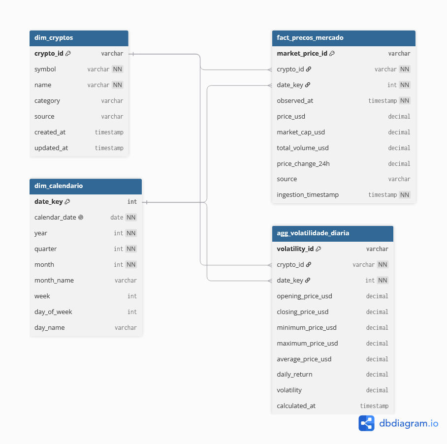

🇧🇷 Português | [🇺🇸 English](README_EN.md)

<div align="center">

# 🚀 Crypto Lakehouse

### *Data Lakehouse de Criptomoedas com Arquitetura Medalhão (Bronze, Silver, Gold)*

[](https://www.python.org/)
[](https://www.getdbt.com/)
[](https://duckdb.org/)
[](https://www.docker.com/)
[](https://airflow.apache.org/)
[](LICENSE)

**Um Data Lakehouse de criptomoedas construído para coletar, processar, transformar e disponibilizar dados de mercado de forma automatizada, testável e estruturada para análises avançadas.**

</div>

---

## 🌟 Principais Funcionalidades

### 1. 🥉 Arquitetura Medalhão — Bronze → Silver → Gold

O projeto implementa uma arquitetura de dados em camadas, separando ingestão, transformação e consumo analítico.

* **Bronze:** ingestão idempotente dos dados brutos da API CoinGecko no **MinIO**, utilizando armazenamento compatível com S3 e chaveamento determinístico.
* **Silver:** desaninhamento (*flattening*), tipagem estrita e transformação dos dados para **Parquet** utilizando **dbt + DuckDB**.
* **Gold:** modelagem dimensional em **Star Schema**, com tabelas fato, dimensões e agregações de volatilidade diária.

Essa separação permite manter os dados brutos preservados enquanto as camadas seguintes são transformadas e reconstruídas de forma controlada.

### 2. ⚙️ Orquestração com Apache Airflow

O pipeline é automatizado através do **Apache Airflow**.

* DAGs para ingestão da camada Bronze.
* Pipeline de transformação Silver → Gold.
* Upload dos dados Gold para Databricks.
* Retries configuráveis.
* Timeouts.
* Logs detalhados.
* Controle de execução concorrente.
* Monitoramento e disparo manual através da interface web do Airflow.

### 3. 🧠 Transformação com dbt + DuckDB

A transformação dos dados utiliza **dbt** e **DuckDB**, permitindo executar modelos SQL de maneira local e reproduzível.

* Modelos SQL organizados por camada.
* Testes de `not_null`, `unique` e `relationships`.
* Leitura direta de dados armazenados em S3 através da extensão `httpfs` do DuckDB.
* Materialização das camadas Silver e Gold em **Parquet**.
* Possibilidade de executar e testar os modelos localmente antes da orquestração completa.

### 4. ☁️ Integração Cloud com Databricks

A camada Gold pode ser integrada a um ambiente cloud utilizando **Databricks**.

* Upload automático dos arquivos Parquet Gold.
* Integração com **Unity Catalog / Volumes**.
* Notebook **PySpark** para conversão dos dados em Delta Tables.
* Estrutura preparada para explorar conceitos de governança e segurança em ambientes cloud.

### 5. 🧪 Testes Automatizados

O projeto possui testes em diferentes níveis para validar tanto a aplicação quanto a qualidade dos dados.

* Testes unitários em Python utilizando `unittest`.
* Mocks para serviços S3 e HTTP.
* Testes de qualidade utilizando dbt.
* Validação de unicidade, não-nulidade e relacionamentos.
* Testes de idempotência.
* Validação de reprocessamento controlado.

---

## 📌 Por que usar este projeto?

O Crypto Lakehouse foi desenvolvido para demonstrar, em um único projeto, um fluxo de Engenharia de Dados próximo de um cenário real.

* **Stack Moderna:** Docker, Apache Airflow, dbt, DuckDB, MinIO e Databricks.
* **Reprodutibilidade:** ambiente definido através de Docker Compose e variáveis de ambiente.
* **Qualidade de Dados:** validações automatizadas durante as transformações.
* **Idempotência:** possibilidade de reprocessar dados sem gerar duplicações indevidas.
* **Separação de Responsabilidades:** ingestão, transformação, armazenamento e consumo são organizados em camadas.
* **Escalabilidade:** a camada Gold é estruturada para consumo posterior por ferramentas de BI, Machine Learning ou Data Science.
* **Integração Local + Cloud:** o projeto permite trabalhar com um Data Lake local e posteriormente disponibilizar os dados no Databricks.
* **Boas Práticas:** tratamento de erros, testes automatizados, organização por responsabilidades e pipelines reproduzíveis.

---

## 🏗️ Arquitetura

O Crypto Lakehouse implementa um fluxo completo de Engenharia de Dados, desde a ingestão dos dados da CoinGecko até a disponibilização das informações na camada Gold e integração com Databricks.

<div align="center">



<p><em>Fluxo de ingestão dos dados de mercado da CoinGecko para a camada Bronze.</em></p>

</div>


<div align="center">


<p><em>Arquitetura geral do Data Lakehouse e fluxo de processamento dos dados.</em></p>

</div>

A execução e as dependências do pipeline são orquestradas pelo **Apache Airflow**, enquanto o armazenamento local utiliza **MinIO** e as transformações SQL utilizam **dbt + DuckDB**.

O fluxo principal pode ser resumido como:

**CoinGecko API → Bronze → Silver → Gold → Databricks / Analytics**

---

## ⚡ Quickstart

### 1. Instalação das Dependências

Recomenda-se utilizar [`uv`](https://github.com/astral-sh/uv) pela velocidade de resolução e instalação das dependências, mas o projeto também pode ser executado utilizando `pip`.

```bash
# Clone o repositório

git clone https://github.com/seu-usuario/crypto-lakehouse.git

cd crypto-lakehouse

# Usando uv

uv venv

# Linux/macOS
source .venv/bin/activate

# Windows
.venv\Scripts\activate

uv pip install -r requirements.txt
```

Ou utilizando `pip`:

```bash
python -m venv .venv

# Linux/macOS
source .venv/bin/activate

# Windows
.venv\Scripts\activate

pip install -r requirements.txt
```

### 2. Configurar as Variáveis de Ambiente

Copie o arquivo de exemplo:

```bash
cp .env.example .env
```

Configure as variáveis necessárias para o ambiente local e para os serviços utilizados pelo projeto.

### 3. Subir a Infraestrutura

Suba os containers utilizando Docker Compose:

```bash
docker compose up -d --build
```

A infraestrutura local inclui os serviços necessários para execução do pipeline, incluindo MinIO, PostgreSQL e Airflow.

Após a inicialização:

* **Airflow:** `http://localhost:8080`
* **MinIO Console:** `http://localhost:9001`

Credenciais padrão do ambiente local:

```text
Airflow
Usuário: admin
Senha: admin

MinIO
Usuário: minioadmin
Senha: minioadmin
```

> As credenciais acima são destinadas ao ambiente local de desenvolvimento.

### 4. Executar o dbt Localmente

Sincronize o ambiente:

```bash
uv sync
```

Configure o perfil do dbt:

```bash
mkdir -p ~/.dbt

cp dbt/profiles.yml ~/.dbt/
```

Valide a configuração:

```bash
uv run dbt debug --profiles-dir ~/.dbt
```

Execute os modelos individualmente:

```bash
# Staging / Bronze
uv run dbt run \
  --select stg_bronze_market \
  --profiles-dir ~/.dbt

# Silver
uv run dbt run \
  --select silver_market_prices \
  --profiles-dir ~/.dbt

# Gold
uv run dbt build \
  --select +marts \
  --profiles-dir ~/.dbt
```

### 5. Executar os Testes

```bash
uv run python -m unittest \
  tests.test_coingecko_bronze \
  tests.test_databricks_upload \
  -v
```

Ou execute o pipeline completo através da interface do Airflow:

```text
http://localhost:8080
```

---

## 💻 Exemplo de Transformação — dbt + DuckDB

O modelo `silver_market_prices.sql` demonstra a transformação dos dados brutos da CoinGecko em uma estrutura tabular tipada e armazenada em Parquet.

```sql
{{ config(
    materialized='external',
    location='s3://silver/market/silver_market_prices.parquet',
    format='parquet'
) }}

with bronze_snapshots as (

    select
        source,
        endpoint,
        reference_date::date as reference_date,
        ingested_at::timestamp as ingested_at,
        vs_currency,
        data

    from {{ ref('stg_bronze_market') }}

),

flattened_market as (

    select

        md5(
            concat(
                reference_date::varchar,
                ':',
                asset.key,
                ':',
                vs_currency
            )
        ) as market_record_id,

        asset.key as crypto_id,

        reference_date,
        ingested_at,
        vs_currency,

        try_cast(
            json_extract_string(asset.value, '$.usd')
            as decimal(38, 8)
        ) as price_usd,

        try_cast(
            json_extract_string(asset.value, '$.usd_market_cap')
            as decimal(38, 8)
        ) as market_cap_usd,

        try_cast(
            json_extract_string(asset.value, '$.usd_24h_vol')
            as decimal(38, 8)
        ) as total_volume_usd,

        try_cast(
            json_extract_string(asset.value, '$.usd_24h_change')
            as decimal(18, 8)
        ) as price_change_24h,

        try_cast(
            json_extract_string(asset.value, '$.last_updated_at')
            as bigint
        ) as source_updated_at,

        source,
        endpoint

    from bronze_snapshots,

    lateral json_each(to_json(data)) as asset

)

select *

from flattened_market

where crypto_id is not null
  and reference_date is not null
```

O modelo realiza o flattening do JSON recebido da CoinGecko, gera um identificador determinístico para os registros e converte os principais indicadores de mercado para tipos numéricos adequados.

---

## 🔎 Consultas de Exemplo

### Silver — Preço e Volume

```sql
SELECT
    crypto_id,
    reference_date,
    price_usd,
    market_cap_usd,
    total_volume_usd,
    price_change_24h

FROM silver_market_prices

ORDER BY reference_date DESC, ingested_at DESC

LIMIT 10;
```

### Gold — Histórico de Preços

```sql
SELECT
    d.symbol,
    f.reference_date,
    f.price_usd,
    f.market_cap_usd,
    f.total_volume_usd

FROM fact_precos_mercado f

JOIN dim_cryptos d
    USING (crypto_id)

ORDER BY f.reference_date DESC

LIMIT 20;
```

### Gold — Volatilidade e Retorno Diário

```sql
SELECT
    d.symbol,
    v.reference_date,
    v.opening_price_usd,
    v.closing_price_usd,
    v.daily_return,
    v.volatility

FROM agg_volatilidade_diaria v

JOIN dim_cryptos d
    USING (crypto_id)

ORDER BY v.reference_date DESC, v.volatility DESC;
```

---

## 🛠️ Tecnologias Utilizadas

| Categoria                    | Tecnologia               | Utilização                                                     |
| ---------------------------- | ------------------------ | -------------------------------------------------------------- |
| **Orquestração**             | Apache Airflow 2.10+     | DAGs, retries, trigger rules, pools e controle de concorrência |
| **Storage**                  | MinIO                    | Object Storage compatível com S3                               |
| **Transformação**            | dbt-core + dbt-duckdb    | Modelagem SQL e testes de qualidade                            |
| **Query Engine**             | DuckDB 1.1+              | Processamento analítico e leitura de Parquet/S3                |
| **Lakehouse Cloud**          | Databricks Unity Catalog | Volumes, Delta Tables e notebooks PySpark                      |
| **Ingestão**                 | Python + requests        | Consumo da API CoinGecko                                       |
| **Containers**               | Docker Compose           | Execução da infraestrutura local                               |
| **Gerenciamento de Pacotes** | uv / pip                 | Ambientes e dependências Python                                |
| **Análise**                  | Pandas / PyArrow         | Exploração adicional e notebooks                               |

---

## 🧪 Testes Automatizados


### Testes de Qualidade com dbt

Validação de integridade, unicidade e relacionamentos dos modelos:

```bash
uv run dbt test --profiles-dir dbt/
```

### Build Completo

Executa os modelos e os testes em sequência:

```bash
uv run dbt build --profiles-dir dbt/
```

---

**Samuel Santos**

Este projeto foi desenvolvido como **portfólio técnico e projeto de estudo**, com foco em Engenharia de Dados, arquiteturas modernas de dados, automação e boas práticas.

---


---

🇧🇷 Português | [🇺🇸 English](README_EN.md)
