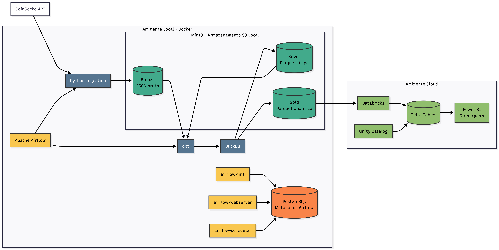

[🇧🇷 Português](README.md) | 🇺🇸 English

<div align="center">

# Crypto Lakehouse

### *Cryptocurrency Data Lakehouse with Medallion Architecture (Bronze, Silver, Gold)*

[](https://www.python.org/)
[](https://www.getdbt.com/)
[](https://duckdb.org/)
[](https://www.docker.com/)
[](https://airflow.apache.org/)

**A cryptocurrency Data Lakehouse built to collect, process, transform, and make market data available in an automated, testable, and structured way for advanced analytics.**

</div>

---

## 🌟 Main Features

### 1. 🥉 Medallion Architecture — Bronze → Silver → Gold

The project implements a layered data architecture, separating ingestion, transformation, and analytical consumption.

* **Bronze:** ingestion of raw data from the CoinGecko API into **MinIO**, using S3-compatible storage.
* **Silver:** flattening, strict typing, and transformation of data into **Parquet** using **dbt + DuckDB**.
* **Gold:** dimensional modeling, with fact tables, dimensions, and daily volatility aggregations.

This separation allows raw data to be preserved while subsequent layers can be transformed and rebuilt in a controlled manner.

### 2. ⚙️ Orchestration with Apache Airflow

The pipeline is automated using **Apache Airflow**.

* DAGs for Bronze layer ingestion.
* Silver → Gold transformation pipeline.
* Upload of Gold data to Databricks.
* Configurable retries.
* Timeouts.
* Detailed logs.
* Concurrent execution control.
* Monitoring and manual triggering through the Airflow web interface.

### 3. 🧠 Transformation with dbt + DuckDB

Data transformation uses **dbt** and **DuckDB**, allowing SQL models to be executed locally and reproducibly.

* SQL models organized by layer.
* Tests for `not_null`, `unique`, and `relationships`.
* Direct access to data stored in S3 through DuckDB's `httpfs` extension.
* Materialization of Silver and Gold layers in **Parquet**.
* Ability to execute and test models locally before running the complete orchestration.

### 4. ☁️ Cloud Integration with Databricks

The Gold layer can be integrated into a cloud environment using **Databricks**.

* Automatic upload of Gold Parquet files.
* Integration with **Unity Catalog / Volumes**.
* **PySpark** notebook for converting data into Delta Tables.
* Structure designed to explore governance and security concepts in cloud environments.

### 5. 🧪 Automated Testing

The project includes tests at different levels to validate both the application and data quality.

* Python unit tests using `unittest`.
* Mocks for S3 and HTTP services.
* Data quality tests using dbt.
* Validation of uniqueness, non-null values, and relationships.
* Controlled reprocessing validation.

---

## 🏗️ Architecture

Crypto Lakehouse implements a complete Data Engineering workflow, from ingesting CoinGecko data to making information available in the Gold layer and integrating it with Databricks.

<div align="center">



<p><em>Market data ingestion flow from CoinGecko into the Bronze layer.</em></p>

</div>

<div align="center">


<p><em>Overall Data Lakehouse architecture and data processing flow.</em></p>

</div>

Pipeline execution and dependencies are orchestrated by **Apache Airflow**, while local storage uses **MinIO** and SQL transformations use **dbt + DuckDB**.

The main flow can be summarized as:

**CoinGecko API → Bronze → Silver → Gold → Databricks / Analytics**

---

## ⚡ Quickstart

### 1. Installing Dependencies

It is recommended to use [`uv`](https://github.com/astral-sh/uv) due to its fast dependency resolution and installation, but the project can also be run using `pip`.

```bash
# Clone the repository

git clone https://github.com/your-username/crypto-lakehouse.git

cd crypto-lakehouse

# Using uv

uv venv

# Linux/macOS
source .venv/bin/activate

# Windows
.venv\Scripts\activate

uv pip install -r requirements.txt
```

Or using `pip`:

```bash
python -m venv .venv

# Linux/macOS
source .venv/bin/activate

# Windows
.venv\Scripts\activate

pip install -r requirements.txt
```

### 2. Configure Environment Variables

Copy the example environment file:

```bash
cp .env.example .env
```

Configure the variables required for the local environment and for the services used by the project.

### 3. Start the Infrastructure

Start the containers using Docker Compose:

```bash
docker compose up -d --build
```

The local infrastructure includes the services required to run the pipeline, including MinIO, PostgreSQL, and Airflow.

After initialization:

* **Airflow:** `http://localhost:8080`
* **MinIO Console:** `http://localhost:9001`

Default credentials for the local environment:

```text
Airflow
Username: admin
Password: admin

MinIO
Username: minioadmin
Password: minioadmin
```

> The credentials above are intended for the local development environment.

### 4. Run dbt Locally

Synchronize the environment:

```bash
uv sync
```

Configure the dbt profile:

```bash
mkdir -p ~/.dbt

cp dbt/profiles.yml ~/.dbt/
```

Validate the configuration:

```bash
uv run dbt debug --profiles-dir ~/.dbt
```

Run the models individually:

```bash
# Staging / Bronze
uv run dbt run \
  --select stg_bronze_market \
  --profiles-dir ~/.dbt

# Silver
uv run dbt run \
  --select silver_market_prices \
  --profiles-dir ~/.dbt

# Gold
uv run dbt build \
  --select +marts \
  --profiles-dir ~/.dbt
```

### 5. Run the Tests

```bash
uv run python -m unittest \
  tests.test_coingecko_bronze \
  tests.test_databricks_upload \
  -v
```

Or run the complete pipeline through the Airflow interface:

```text
http://localhost:8080
```

---

## 💻 Transformation Example — dbt + DuckDB

The `silver_market_prices.sql` model demonstrates the transformation of raw CoinGecko data into a typed tabular structure stored in Parquet.

```sql
{{ config(
    materialized='external',
    location='s3://silver/market/silver_market_prices.parquet',
    format='parquet'
) }}

with bronze_snapshots as (

    select
        source,
        endpoint,
        reference_date::date as reference_date,
        ingested_at::timestamp as ingested_at,
        vs_currency,
        data

    from {{ ref('stg_bronze_market') }}

),

flattened_market as (

    select

        md5(
            concat(
                reference_date::varchar,
                ':',
                asset.key,
                ':',
                vs_currency
            )
        ) as market_record_id,

        asset.key as crypto_id,

        reference_date,
        ingested_at,
        vs_currency,

        try_cast(
            json_extract_string(asset.value, '$.usd')
            as decimal(38, 8)
        ) as price_usd,

        try_cast(
            json_extract_string(asset.value, '$.usd_market_cap')
            as decimal(38, 8)
        ) as market_cap_usd,

        try_cast(
            json_extract_string(asset.value, '$.usd_24h_vol')
            as decimal(38, 8)
        ) as total_volume_usd,

        try_cast(
            json_extract_string(asset.value, '$.usd_24h_change')
            as decimal(18, 8)
        ) as price_change_24h,

        try_cast(
            json_extract_string(asset.value, '$.last_updated_at')
            as bigint
        ) as source_updated_at,

        source,
        endpoint

    from bronze_snapshots,

    lateral json_each(to_json(data)) as asset

)

select *

from flattened_market

where crypto_id is not null
  and reference_date is not null
```

The model flattens the JSON received from CoinGecko, generates a deterministic identifier for the records, and converts the main market indicators into appropriate numeric types.

---

## 🔎 Example Queries

### Silver — Price and Volume

```sql
SELECT
    crypto_id,
    reference_date,
    price_usd,
    market_cap_usd,
    total_volume_usd,
    price_change_24h

FROM silver_market_prices

ORDER BY reference_date DESC, ingested_at DESC

LIMIT 10;
```

### Gold — Price History

```sql
SELECT
    d.symbol,
    f.reference_date,
    f.price_usd,
    f.market_cap_usd,
    f.total_volume_usd

FROM fact_precos_mercado f

JOIN dim_cryptos d
    USING (crypto_id)

ORDER BY f.reference_date DESC

LIMIT 20;
```

### Gold — Daily Volatility and Return

```sql
SELECT
    d.symbol,
    v.reference_date,
    v.opening_price_usd,
    v.closing_price_usd,
    v.daily_return,
    v.volatility

FROM agg_volatilidade_diaria v

JOIN dim_cryptos d
    USING (crypto_id)

ORDER BY v.reference_date DESC, v.volatility DESC;
```

---

## 🧪 Automated Testing

### Data Quality Tests with dbt

Validation of model integrity, uniqueness, and relationships:

```bash
uv run dbt test --profiles-dir dbt/
```

### Complete Build

Runs the models and tests sequentially:

```bash
uv run dbt build --profiles-dir dbt/
```

---

## 👨‍💻 Author

**Samuel Santos**

This project was developed as a **technical portfolio and study project**, focused on Data Engineering, modern data architectures, automation, and best practices.

---

🇧🇷 [Português](README.md) | 🇺🇸 English
